```mermaid
%%{init: {'theme':'base', 'themeVariables': { 'fontSize':'14px'}}}%%
graph LR
    subgraph Ready["🟢 Ready to Start"]
        v01[v0.1.0<br/>Simple Forms]
    end

    subgraph Planned["⏳ Planned"]
        v02[v0.2.0<br/>Data Display]
        v03[v0.3.0<br/>Complex Components]
        v04[v0.4.0<br/>ReX Theming]
        v05[v0.5.0<br/>Multi-Theme]
    end

    v01 --> v02
    v02 --> v03
    v03 --> v04
    v04 --> v05

    style v01 fill:#4caf50,stroke:#333,stroke-width:2px,color:#fff
    style v02 fill:#ffc107,stroke:#333,stroke-width:2px
    style v03 fill:#ffc107,stroke:#333,stroke-width:2px
    style v04 fill:#ffc107,stroke:#333,stroke-width:2px
    style v05 fill:#ffc107,stroke:#333,stroke-width:2px
```

# Storybook Multi-Theme Demo - Roadmap

> 🤖
>
> - [README](README.md) - Our project
> - [CHANGELOG](CHANGELOG.md) — What we did
> - [ROADMAP](ROADMAP.md) — What we wanna do
> - [POLICY](POLICY.md) — How we do it
> - [HEALTH](HEALTH.md) — What we accept
>
> 🤖

---

## v0.1.0

### [🚧](https://github.com/wiley/pp-ux-tooling/tree/rex) ReX Flow: Simple Form Screens (Vanilla MUI)

⏳ Implement basic form screens using vanilla MUI components

**Problem:** Need to establish baseline implementation pattern for ReX flow screens without theme complexity

**Solution:** Build 3 simple form screens (Title, Abstract, Article Type) using out-of-the-box MUI components to validate structure, data flow, and accessibility patterns

**Scope:** LOW - Simple text inputs, radio groups, standard form validation

**Why these first:**

- Minimal UI complexity (text fields, radio buttons)
- Establishes form validation patterns
- No custom components required
- Can merge to main quickly to show progress

**Screens:**

1. **05 - Title** (2 text fields)
2. **06 - Abstract** (1 multiline text field + character count)
3. **03 - Article Type** (radio group + dropdown)

**Tasks:**

- [ ] 05-Title: Implement title + subtitle text fields with validation
- [ ] 06-Abstract: Implement multiline abstract field with character counter
- [ ] 03-ArticleType: Implement radio group for type + dropdown for category
- [ ] Add form validation (required fields, max length)
- [ ] Add navigation (Next/Back buttons, stepper integration)
- [ ] Write interaction tests (play functions)
- [ ] Document implementation patterns in epic notes
- [ ] Code review + merge to main

**Success Criteria:**

- All 3 screens render without errors
- Form validation works correctly
- Navigation between screens functional
- Storybook build passes (`npm run validate`)
- Tests pass
- Safe to deploy to main

**Documentation:** See [/docs/rex-migration/README.md](docs/rex-migration/README.md) | [notes](docs/rex-migration/) | [Figma assets](reference/ReX%20steps/)

---

## v0.2.0

### ReX Flow: Data Display Screens (Vanilla MUI)

⏳ Implement dashboard and list-based screens using vanilla MUI

**Problem:** Need to display manuscript submissions in list and kanban formats with status management

**Solution:** Build 2 data-heavy screens (My Submissions, Progress Board) using MUI Cards, Lists, and Grids

**Scope:** MEDIUM - Cards, lists, status chips, empty states, loading states

**Why these next:**

- Builds on form patterns from v0.1.0
- Establishes card/list component patterns
- More visual complexity but still standard MUI
- Ready for theming in v0.4.0

**Screens:**

1. **01 - My Submissions** (Dashboard with submission cards)
2. **02 - Progress Board** (Kanban-style board with columns)

**Tasks:**

- [ ] 01-MySubmissions: Implement submission card grid with status badges
- [ ] 01-MySubmissions: Add empty state + loading state
- [ ] 02-ProgressBoard: Implement kanban columns with draggable cards
- [ ] Add status chip variants (draft, submitted, under review, etc.)
- [ ] Add card actions (view, edit, delete)
- [ ] Implement search/filter functionality
- [ ] Write interaction tests
- [ ] Document card/list patterns
- [ ] Code review + merge to main

**Success Criteria:**

- Dashboard displays submissions correctly
- Kanban board allows drag-and-drop
- Status badges styled appropriately
- Empty/loading states handled
- Safe to merge to main

**Documentation:** [notes](docs/rex-migration/)

---

## v0.3.0

### ReX Flow: Complex Components (Vanilla MUI)

⏳ Implement screens requiring custom components and advanced interactions

**Problem:** Remaining screens need drag-and-drop file upload, autocomplete, multi-step forms, and custom validation

**Solution:** Build 10 complex screens using MUI Autocomplete, custom drag-and-drop, multi-item management, and fuzzy matching

**Scope:** HIGH - Custom components, complex validation, multi-step flows, async operations

**Why these last for vanilla:**

- Requires patterns established in v0.1.0 + v0.2.0
- Most complex implementation work
- Drag-and-drop needs custom styling
- Author/affiliation management needs state patterns
- Should be complete before applying ReX theme

**Screens:**

1. **04 - Upload Manuscript** (Drag & drop file upload)
2. **07 - Affiliation** (Autocomplete + multi-select)
3. **08 - Authors** (List management - add/edit/delete)
4. **09 - Author Details** (Complex form with validation)
5. **10 - Match Organizations** (Fuzzy search + confirmation)
6. **11 - Additional Information** (Keywords, funding, declarations)
7. **12 - Open Access** (License selection + agreements)
8. **13 - Final Review** (Summary of all data + validation)
9. **14 - Submission Overview** (Post-submission confirmation)
10. **15 - Confetti Screen** (Success animation)

**Tasks:**

- [ ] 04-Upload: Implement drag-and-drop file upload with progress
- [ ] 07-Affiliation: Implement autocomplete with custom affiliation option
- [ ] 08-Authors: Implement author list with add/edit/delete
- [ ] 09-AuthorDetails: Implement author form with validation
- [ ] 10-MatchOrganizations: Implement fuzzy matching UI
- [ ] 11-AdditionalInfo: Implement keywords, funding, declarations forms
- [ ] 12-OpenAccess: Implement license picker + agreement checkboxes
- [ ] 13-FinalReview: Implement summary with edit navigation
- [ ] 14-SubmissionOverview: Implement confirmation with next steps
- [ ] 15-Confetti: Implement success animation (Lottie or CSS)
- [ ] Add file validation (type, size limits)
- [ ] Add multi-item state management patterns
- [ ] Write comprehensive interaction tests
- [ ] Document complex component patterns
- [ ] Code review + merge to main

**Success Criteria:**

- All 15 screens implemented in vanilla MUI
- Drag-and-drop works across browsers
- Author/affiliation management robust
- Form validation comprehensive
- All screens safe to merge to main

**Documentation:** See [COMPONENTS.md](docs/rex-migration/COMPONENTS.md) for MUI mapping | [notes](docs/rex-migration/)

---

## v0.4.0

### ReX Theme Application

⏳ Apply ReX design system theme to all 15 vanilla MUI screens

**Problem:** Screens use default MUI styling, need ReX visual identity (colors, typography, spacing)

**Solution:** Apply existing ReX theme (already created in Phase 1) to all screens via theme-level customization

**Scope:** MEDIUM - Theme application, visual QA, Figma fidelity

**Why separate epic:**

- Clean separation: structure (v0.1-0.3) vs. styling (v0.4)
- Easier to review visual changes independently
- Can validate vanilla implementation before theming
- Allows A/B comparison (vanilla vs. themed)

**ReX Theme Assets (Already Complete):**

- ✅ Colors (semantic, grayscale, brand)
- ✅ Typography (Open Sans scale)
- ✅ Spacing (5-tier system: 1/2/3/6/12)
- ✅ Icons (60+ SVG icons)
- ✅ Component overrides (Button, Chip)

**Tasks:**

- [ ] Apply ReX theme to all 15 screens
- [ ] Visual QA against Figma designs (Desktop)
- [ ] Adjust spacing to match Figma (using semantic spacing)
- [ ] Verify typography scales match design
- [ ] Verify color usage (semantic colors)
- [ ] Update component overrides as needed
- [ ] Test light/dark mode support
- [ ] Document theme customizations
- [ ] Storybook visual regression tests (Chromatic)
- [ ] Code review + merge to main

**Success Criteria:**

- All screens visually match Figma designs
- ReX theme applied consistently
- Light/dark mode working
- No regressions in functionality
- Safe to merge to main

**Documentation:** See [ReX Theme Specs](docs/rex-migration/README.md#rex-theme-specifications) | [notes](docs/rex-migration/)

---

## v0.5.0

### Multi-Theme Support for ReX Flow

⏳ Enable ReX screens to work with multiple theme variants (Wiley, Sage, Tech, etc.)

**Problem:** ReX flow is locked to ReX theme, but Wiley platform supports 6+ themes

**Solution:** Abstract theme dependencies, test ReX screens with all existing themes, create theme-switching UI

**Scope:** LOW - Theme abstraction, testing, documentation

**Why later:**

- Depends on complete ReX implementation (v0.1-0.4)
- Lower priority than core functionality
- Demonstrates reusability of component work

**Tasks:**

- [ ] Audit ReX screens for theme-specific hardcoding
- [ ] Abstract theme dependencies (use theme tokens)
- [ ] Test ReX flow with Default theme
- [ ] Test ReX flow with Sage theme
- [ ] Test ReX flow with Wiley theme
- [ ] Test ReX flow with Wiley2025 theme
- [ ] Test ReX flow with Phenom theme
- [ ] Test ReX flow with Tech theme
- [ ] Add theme switcher to ReX flow stories
- [ ] Document multi-theme patterns
- [ ] Code review + merge to main

**Success Criteria:**

- ReX screens render correctly in all 6 themes
- No theme-specific bugs
- Theme switching smooth
- Documentation complete

**Documentation:** [notes](docs/rex-migration/)

---

## Future Ideas

**Backlog items for consideration:**

- **Mobile/Responsive Implementation** - Adapt ReX screens for mobile/tablet (separate epic from theming)
- **Data Layer Integration** - Connect ReX flow to Supabase manuscript submission backend
- **Accessibility Audit** - Full WCAG 2.1 AA compliance testing
- **Animation Polish** - Add micro-interactions, transitions (ReX Design System guidelines)
- **Performance Optimization** - Code splitting, lazy loading for large forms
- **Internationalization (i18n)** - Multi-language support for global deployment

---

**Last updated:** 2026-01-29
**Current branch:** `rex`
**Next epic:** v0.1.0 (Simple Forms)
